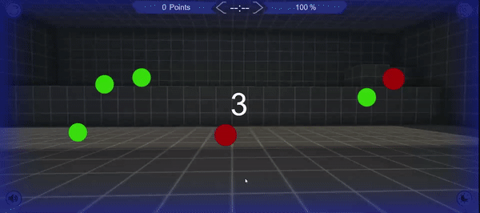
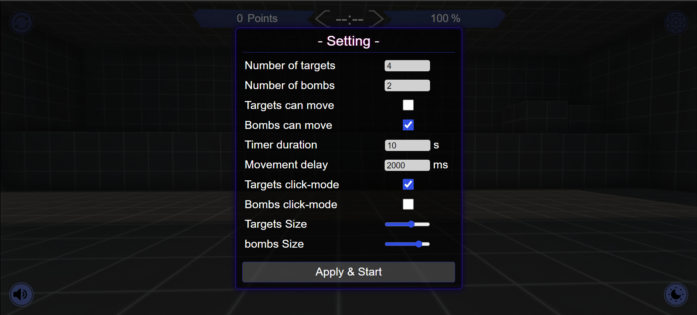
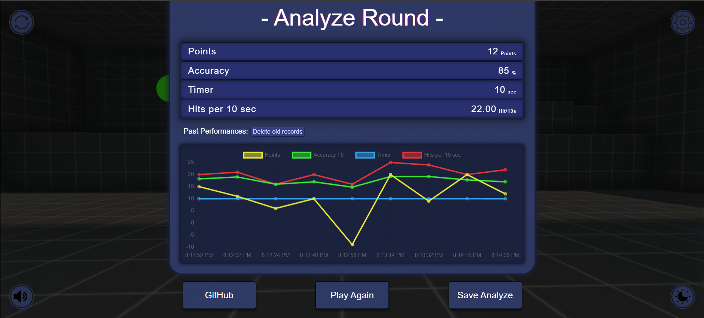

<h1>Aim-Lab-TS🎯</h1>

<h2>Overview</h2>

    Aim-Lab-TS is a meticulously crafted web-based game designed to enhance your
    aiming skills. Built using a combination of HTML, SCSS, CSS, JavaScript and
    TypeScript, this project offers a dynamic and engaging experience for users
    seeking to refine their precision.

<h2>Features</h2>
<ul>
    <li>
        

            <strong>Customizable Settings:</strong> Begin your training by
            adjusting various parameters in the settings page. Modify the number
            of targets and bombs, enable or disable movement for targets and
            bombs, set the game timer, and fine-tune other gameplay aspects
            according to your preference.
        

    </li>
    <li>
        

            <strong>Real-time Analytics:</strong> Track your performance with
            real-time analytics displayed at the end of each game. View your
            points, accuracy, game timer, and hits per 10 seconds, providing
            valuable insights into your progress.
        

    </li>
    <li>
        

            <strong>Performance History:</strong> A detailed table showcases
            your past performances, allowing you to monitor your improvement
            over time. The data is conveniently stored in local storage for easy
            access.
        

    </li>
    <li>
        

            <strong>Themes and Animations:</strong> Choose between two
            themes—white and dark—to suit your visual preference. Enjoy smooth
            and captivating animations that contribute to an immersive gaming
            experience.
        

    </li>
    <li>
        

            <strong>Dynamic Soundtracks:</strong> Immerse yourself in the game
            with a set of carefully curated soundtracks. From the countdown to
            the game start, hitting targets, activating bombs, to the game's
            conclusion, each sound enhances the overall gaming atmosphere.
        

    </li>
    <li>
        

            <strong>User-Friendly Interface:</strong> The intuitive user
            interface includes a volume control button, a reload button for
            restarting the game without reloading the page, and a settings
            button for easy customization.
        

    </li>
</ul>

Setting Menu

End Screen Menu

<h2>Development Journey</h2>

    This project serves as a testament to the developer's commitment to
    mastering TypeScript. The development process spanned a month, and I
    recorded almost every second of its development. In the end, I had 36 hours
    of footage, which I then compressed into a 2-minute time-lapse, allowing you
    to witness how the project came to life. This time-lapse is available on
    <a target="_new" href="https://youtu.be/GUWZojIEkEg">YouTube</a>.

<h2>Live Demo</h2>

    Experience Aim-Lab-TS live!
    <a target="_new" href="https://ali-sdg90.github.io/Aim-Lab-TS/"
        >Demo Here</a
    >

<h2>Conclusion</h2>

    Aim-Lab-TS is not just a game. it's a carefully crafted tool for skill
    improvement. With a focus on user experience, customization, and developer
    mastery. Explore, play, and witness your progress in the pursuit of
    precision. Happy coding! ❤️

<h2>CI/CD Process</h2>

    This project uses GitHub Actions for Continuous Integration (CI) and Continuous Deployment (CD). The CI/CD pipeline is defined in the <code>.github/workflows/ci-cd.yml</code> file.

<h3>Steps in the CI/CD Pipeline</h3>
<ul>
    <li>
        <strong>Build:</strong> This step checks out the repository, sets up Node.js, installs dependencies, and builds the project using the <code>npm run build</code> command.
    </li>
    <li>
        <strong>Test:</strong> This step runs after the build step. It checks out the repository, sets up Node.js, installs dependencies, and runs tests using the <code>npm test</code> command.
    </li>
    <li>
        <strong>Deploy:</strong> This step runs after the test step. It checks out the repository, sets up Node.js, installs dependencies, and deploys the project to GitHub Pages using the <code>npm run deploy</code> command.
    </li>
</ul>
<h3>Running CI/CD Processes Locally</h3>

    You can run the CI/CD processes locally using the following commands:

<ul>
    <li>
        <strong>Build:</strong> <code>npm run build</code>
    </li>
    <li>
        <strong>Test:</strong> <code>npm test</code>
    </li>
    <li>
        <strong>Deploy:</strong> <code>npm run deploy</code>
    </li>
</ul>
